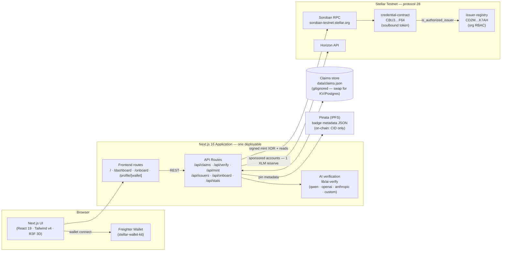
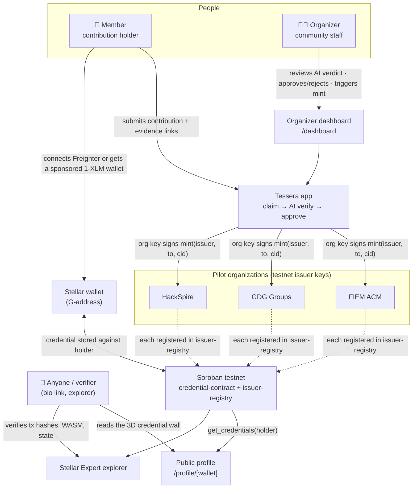
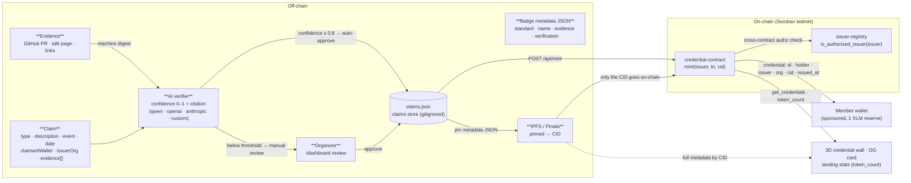
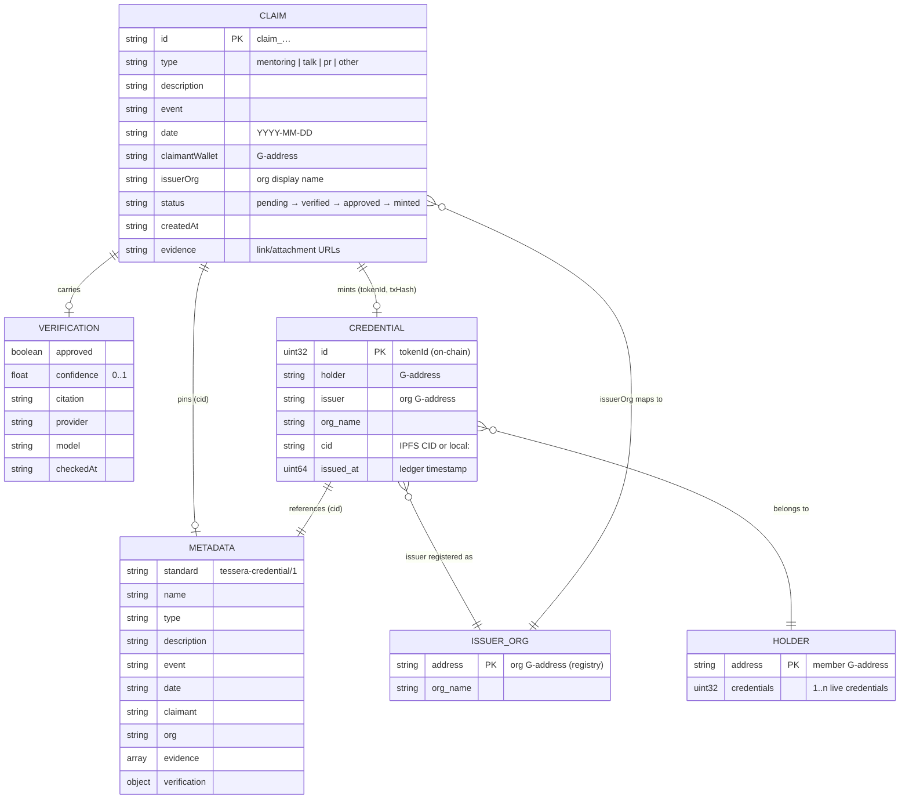
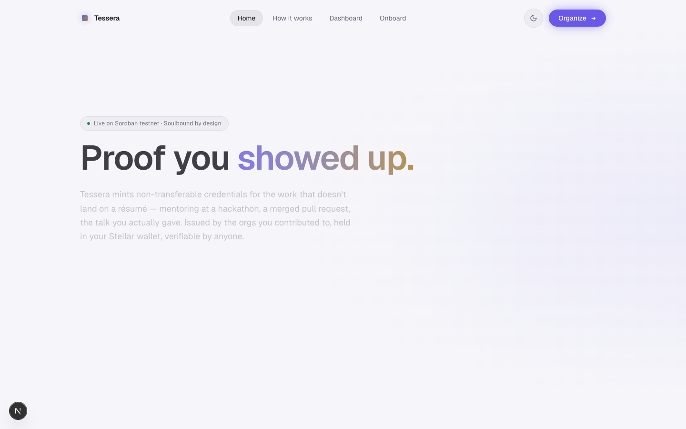
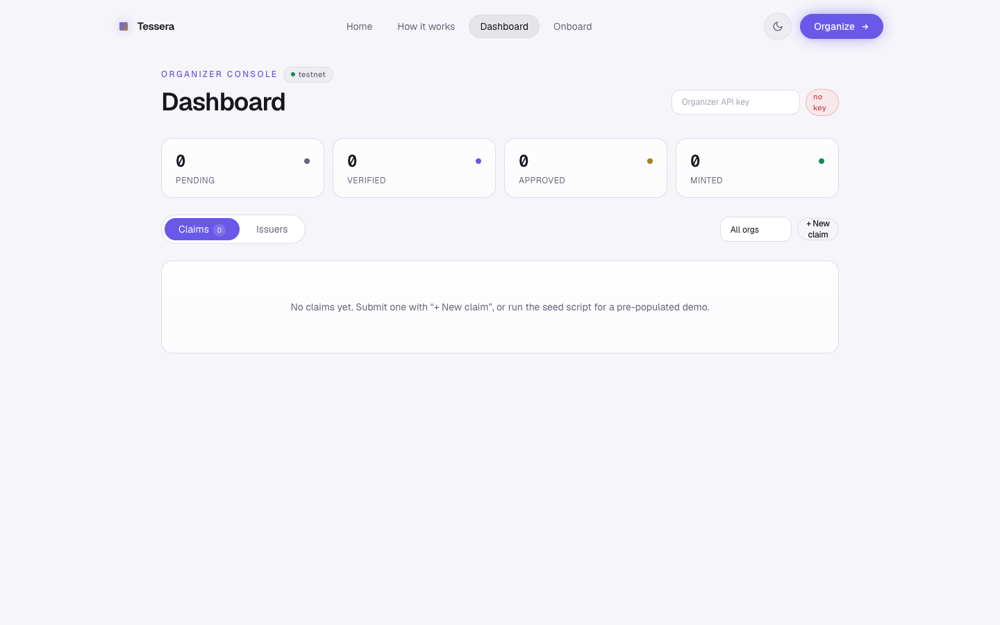
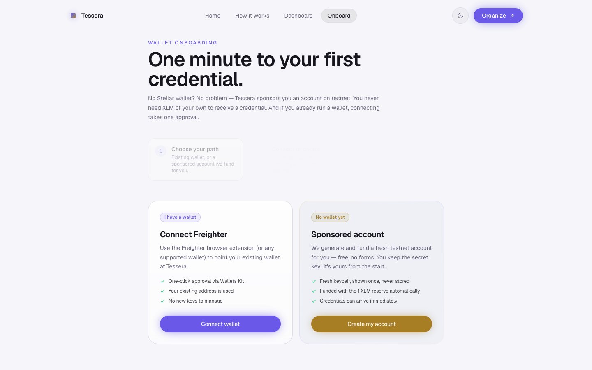
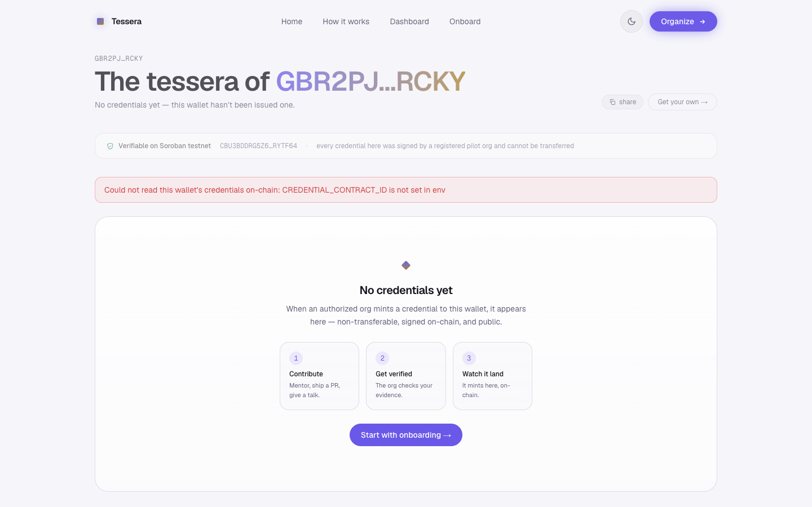
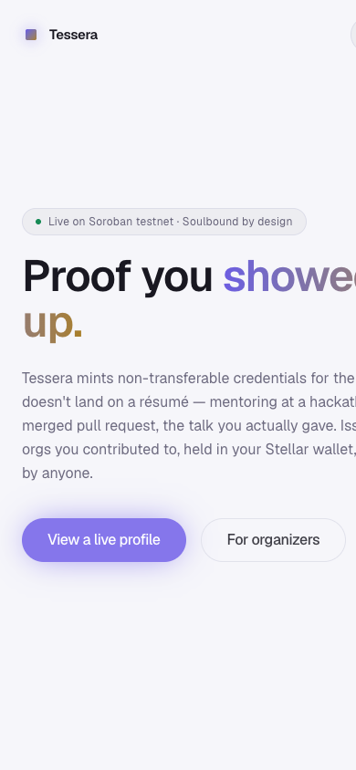
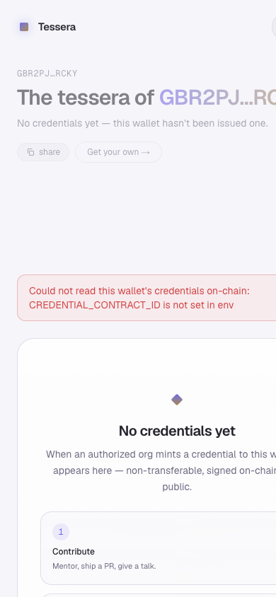

# Tessera — ProofOfContribution

[](https://github.com/techishan432/Tessera/actions/workflows/ci.yml)

> **"Your contribution, proven on-chain. Soulbound. Verifiable by anyone."**

Tessera mints **non-transferable (soulbound) credentials** on Stellar's **Soroban** smart-contract platform for the work that never lands on a résumé: mentoring at a hackathon, a merged open-source PR, the talk you actually gave. Authorized community organizations issue them; they land in a member's Stellar wallet as a portable, verifiable Web3 résumé — a public 3D "credential wall" you can drop a link to in your bio.

🌐 **Live Production Demo**: [https://tessera-beta-five.vercel.app](https://tessera-beta-five.vercel.app)
📹 **Live Demo Video**: [https://youtu.be/gB-rpFftlVU](https://youtu.be/gB-rpFftlVU)
📁 **Public GitHub Repo**: [https://github.com/techishan432/Tessera](https://github.com/techishan432/Tessera)

**Pilot communities:** FIEM ACM · GDG Groups · HackSpire

> A *tessera* is a mosaic tile — and, in Rome, the citizen's identity token.
>
> **Target: Soroban testnet (protocol 28). Mainnet is never touched by this codebase.**

---

## 🏗️ Architecture



- **Contracts hold only what must be trustlessly enforced** — issuer authorization, non-transferability (`transfer` always reverts), holder/issuer revocation. All business data (claim text, evidence links, AI verdict) lives off-chain; on-chain we store just the metadata CID.
- **Orchestration lives in the API routes** — the claim lifecycle (`pending → verified → approved → minted`), AI verification, IPFS pinning, sponsored account creation, and org-key signing.
- **Wallet layer** — Freighter via stellar-wallet-kit for members who have a wallet, or a sponsored zero-XLM account for those who don't (see [onboarding](#-local-development-setup-localhost)).

### User & actor diagram

Who is involved, and what each of them does:



### Data flow diagram

Where each piece of data is created, transformed, and stored:



### Entity–relationship diagram

The data model across the claims store (off-chain) and the two contracts (on-chain):



> **Trust split:** `CLAIM`, `VERIFICATION`, and `METADATA` live off-chain (mutable, human-readable). `CREDENTIAL` and `ISSUER_ORG` live on-chain (immutable, trustless). The only bridge is the **CID** — so the on-chain record stays tiny while the badge content stays rich and auditable.

### The credential lifecycle

1. **Claim submitted** — a member (or the organizer on their behalf) submits a contribution with evidence links → `POST /api/claims`
2. **AI verifies** — `POST /api/verify` machine-digests the evidence (live GitHub PR state, page snippets) and a strict verifier LLM cross-checks claim vs. facts, returning confidence + citation. At/above `VERIFY_AUTO_APPROVE_THRESHOLD` (default 0.8) the claim auto-approves; below it is flagged for the organizer.
3. **Organizer approves** — in the dashboard, review the AI verdict and approve → `PATCH /api/claims/:id` (protected by `x-organizer-key`)
4. **Minted** — `POST /api/mint` ensures the recipient account is sponsored (1 XLM reserve — the member never needs XLM), pins the metadata JSON to IPFS, and calls `credential-contract.mint()` **signed by the pilot org's own key**
5. **Profile** — the credential appears on the member's public 3D credential wall, instantly shareable → `/profile/[wallet]` (auto-generated OpenGraph card included)
6. **Soulbound** — any `transfer` attempt reverts on-chain (pinned by a unit test and demonstrated live by the seed script)

---

## 📜 Soroban Smart Contracts & Deployment Details (Stellar Testnet)

The two contracts form the trust core: `credential-contract` mints soulbound credentials and `issuer-registry` decides which organizations may mint.

### `credential-contract` (Rust)

| Entrypoint | Auth | Behavior |
| :--- | :--- | :--- |
| `initialize(admin, registry)` | admin, one-shot | points the contract at the issuer registry that gates minting |
| `set_registry(admin, registry)` | admin, one role | re-point after a registry redeploy |
| `mint(issuer, to, metadata_cid)` | issuer must sign + be registry-authorized | sequential on-chain IDs; stores holder, issuer, org name, CID, timestamp |
| `transfer(from, to, id)` | — | **always reverts.** The soulbound invariant |
| `burn(authorized_by, token_id)` | holder **or** issuing org | self-revocation / org revocation |
| `get_credentials(holder)` · `get_token(id)` · `token_count()` | none | public reads powering profile + landing stats |

### `issuer-registry` (Rust)

| Entrypoint | Auth | Behavior |
| :--- | :--- | :--- |
| `initialize(admin)` | admin, one-shot | bootstraps the registry |
| `add_issuer(admin, issuer, org_name)` | admin | registers an org's signing address |
| `remove_issuer(admin, issuer)` | admin | revokes new mints; previously minted credentials stay valid |
| `is_authorized_issuer(issuer)` · `org_name(issuer)` · `get_issuers()` · `get_admin()` | none | public reads (the credential contract calls `is_authorized_issuer` on every mint) |

| Parameter | Value / Address | Status |
| :--- | :--- | :-: |
| **Network** | **Stellar Testnet** (protocol 28) | 🟢 Live |
| **`credential-contract` ID** | [`CBU3BDDRG5Z6XOS5JID7FZBOQJE7PZCUUIYZGWTZGS3AGEUPU4RYTF64`](https://stellar.expert/explorer/testnet/contract/CBU3BDDRG5Z6XOS5JID7FZBOQJE7PZCUUIYZGWTZGS3AGEUPU4RYTF64) | 🟢 Verified |
| **`issuer-registry` ID** | [`CD2MLVE5YNLFELC4FKV5NDYFJ3YRN6IQXEQXUNCXTIFZLUUTNFZCK7AH`](https://stellar.expert/explorer/testnet/contract/CD2MLVE5YNLFELC4FKV5NDYFJ3YRN6IQXEQXUNCXTIFZLUUTNFZCK7AH) | 🟢 Verified |
| **Deployer / Admin Wallet** | [`GDQZIUOFLL5OPCYTDJE4YO766AJQYZ3XQQIZ6BO27ADKEE24GMX72LYS`](https://stellar.expert/explorer/testnet/account/GDQZIUOFLL5OPCYTDJE4YO766AJQYZ3XQQIZ6BO27ADKEE24GMX72LYS) | 🟢 Active |
| **credential WASM sha256** | `ae43a75cf8c96cb98cb3449c68991ba75f97059ff8d16f98300971ae4214a86b` (18,848 B) | 🟢 Matches on-chain |
| **registry WASM sha256** | `2f95a6563845f9911ebe031e0ef1a8a0f479c69f1f075e8e475e5393ad7f3f3e` (8,339 B) | 🟢 Matches on-chain |
| **Credential Explorer** | [View credential-contract on Stellar Expert](https://stellar.expert/explorer/testnet/contract/CBU3BDDRG5Z6XOS5JID7FZBOQJE7PZCUUIYZGWTZGS3AGEUPU4RYTF64) | 🔗 Explorer |
| **Registry Explorer** | [View issuer-registry on Stellar Expert](https://stellar.expert/explorer/testnet/contract/CD2MLVE5YNLFELC4FKV5NDYFJ3YRN6IQXEQXUNCXTIFZLUUTNFZCK7AH) | 🔗 Explorer |
| **Deployer Explorer** | [View Deployer Account on Stellar Expert](https://stellar.expert/explorer/testnet/account/GDQZIUOFLL5OPCYTDJE4YO766AJQYZ3XQQIZ6BO27ADKEE24GMX72LYS) | 🔗 Explorer |

> **WASM provenance:** the on-chain WASM hashes (via the Stellar Expert contract API) are byte-identical to the SHA-256 of the `target/wasm32v1-none/release/` artifacts built from this repo's `contracts/` — i.e. the deployed code is exactly the code in the repository.

---

## 🔗 On-Chain Verification Log — Testnet (2026-08-29 / 2026-08-30)

Every transaction below was re-verified against Horizon, the Soroban RPC, and the Stellar Expert API on 2026-08-30 and covers the full lifecycle — deployment, setup, live state reads, issuance, and the security-critical soulbound rejection:

| # | Action | Result | Transaction Hash | Ledger |
| :-: | :--- | :-: | :--- | :-: |
| **1** | `issuer-registry` deployment (`create_contract`) by `GDQZ…2LYS` | ✅ | [`6ced192da946eba6b71340355a00c75a196acc6f418a4a8d2d7bd74cf28b2e4a`](https://stellar.expert/explorer/testnet/tx/6ced192da946eba6b71340355a00c75a196acc6f418a4a8d2d7bd74cf28b2e4a) | 4402632 |
| **2** | registry `initialize(admin)` | ✅ | [`baee08d25fd4573948ffd2415fa0531e1f540573bea0ef6a6ec9324fb0b63b5b`](https://stellar.expert/explorer/testnet/tx/baee08d25fd4573948ffd2415fa0531e1f540573bea0ef6a6ec9324fb0b63b5b) | 4402635 |
| **3** | credential-contract WASM upload | ✅ | [`9c07b5e2bc98a570f5dc891c93cc4d2c324c795fd85e403e0189e06c7b6f6687`](https://stellar.expert/explorer/testnet/tx/9c07b5e2bc98a570f5dc891c93cc4d2c324c795fd85e403e0189e06c7b6f6687) | 4402637 |
| **4** | `credential-contract` deployment (`create_contract`) | ✅ | [`c16a20c4265a53af1436b369eb51c963c3e570372b79a518db9fca23dd4bc5ef`](https://stellar.expert/explorer/testnet/tx/c16a20c4265a53af1436b369eb51c963c3e570372b79a518db9fca23dd4bc5ef) | 4402638 |
| **5** | registry `add_issuer` × 3 (FIEM ACM, GDG Groups, HackSpire) + credential `initialize(admin, registry)` | ✅ verified via live state (rows 6–7) | — | 4402639+ |
| **6** | Live read: `credential-contract.token_count()` | ✅ returned `6` | — | — |
| **7** | Live read: `issuer-registry.get_issuers()` | ✅ returned the 3 pilot orgs + addresses | — | — |
| **8** | `mint` token #4 — HackSpire · mentoring (claimant `GBR2…CKY`) | ✅ fee ≈ 0.00004 XLM | [`34b339b1eeae2d656b3eadc014c0ad2c1c17a72f839a44058879cb22f30b5eba`](https://stellar.expert/explorer/testnet/tx/34b339b1eeae2d656b3eadc014c0ad2c1c17a72f839a44058879cb22f30b5eba) | 4413771 |
| **9** | `mint` token #5 — GDG Groups · open-source PR (claimant `GB4B…ST5`) | ✅ | [`d139e6a61596911260464d06ca5679ec8bbec7a3bce8c375a23abfd14e9d93b7`](https://stellar.expert/explorer/testnet/tx/d139e6a61596911260464d06ca5679ec8bbec7a3bce8c375a23abfd14e9d93b7) | 4413773 |
| **10** | `mint` token #6 — FIEM ACM · talk (claimant `GCNE…T3`) | ✅ | [`eb00382c0c76d6f5cda088a9cc450958b1fe21bf2745b8889b20950c2f2d43f0`](https://stellar.expert/explorer/testnet/tx/eb00382c0c76d6f5cda088a9cc450958b1fe21bf2745b8889b20950c2f2d43f0) | 4413775 |
| **11** | `transfer` attempt on token #4 (soulbound check, run by `npm run seed`) | ❌ rejected on-chain — **as designed** | — (failed tx) | — |

Notes:

- Rows 8–10 were each signed by the respective **pilot org's own issuer key** (not the operator) — the orgs mint their own credentials; the registry is what makes it possible.
- The mints succeed only because row 5's setup (registry `initialize`, three `add_issuer` calls, credential `initialize`) already completed — the registry gate and the registry pointer are preconditions enforced inside `mint`.
- Live state reads (rows 6–7) were performed on 2026-08-30 via read-only RPC simulation; `token_count = 6` also includes the three credentials from the earlier end-to-end validation pass (tokens #1–#3).

---

## 🧪 Smart Contract Unit Test Output (16/16 Tests Passing)

Internal security review and test suite run (no external audit performed):

```bash
cd contracts && cargo test --workspace
```

```text
Running tests/soulbound.rs (credential-contract)

running 10 tests
test mint_after_issuer_revocation_fails ... ok
test set_registry_is_admin_gated ... ok
test mint_by_unauthorized_address_fails ... ok
test burn_by_holder_self_revoke ... ok
test burn_by_issuer_revokes ... ok
test burn_by_unrelated_address_fails ... ok
test mint_by_authorized_issuer_succeeds ... ok
test transfer_always_fails_soulbound ... ok
test multiple_issuers_each_track_their_credentials ... ok
test get_credentials_excludes_burned_and_keeps_order ... ok

test result: ok. 10 passed; 0 failed; 0 ignored; 0 measured; 0 filtered out

Running tests/registry.rs (issuer-registry)

running 6 tests
test unregistered_address_is_not_authorized ... ok
test remove_unknown_issuer_fails ... ok
test only_admin_can_remove_issuer ... ok
test only_admin_can_add_issuer ... ok
test add_issuer_registers_org_name ... ok
test remove_issuer_revokes_authorization ... ok

test result: ok. 6 passed; 0 failed; 0 ignored; 0 measured; 0 filtered out
```

Coverage includes issuer authorization for minting, revocation (issuer and holder), the soulbound `transfer` invariant, admin-gated registry mutation, and burned-credential ordering.

Frontend verification pipeline is covered separately:

```bash
npx vitest run
# Test Files  1 passed (1)
#      Tests  16 passed (16)   ← tests/ai-verify.test.ts
```

---

## 📊 Analytics, RPC Health & Monitoring Setup

Tessera reads the chain as its source of truth for everything public-facing:

- ⚡ **Live on-chain stats** — `GET /api/stats` reads `credential-contract.token_count()` and `issuer-registry.get_issuers()` via read-only Soroban RPC simulation (no fee, no auth) and merges them with the member count from the claims store. The landing page renders these as live count-up numbers — the stats are *the chain*, not a counter in the database.
- 🧱 **Real-time profile reads** — `get_credentials(holder)` powers `/profile/[wallet]` and its OpenGraph card, which is generated on demand from live on-chain state, so a shared link always shows the current wall.
- 🔍 **Stellar Horizon sync** — `https://horizon-testnet.stellar.org` is used for sponsored-account creation (operator-funded, 1 XLM reserve) and balance/account existence checks during onboarding and minting.
- 🛰️ **Soroban RPC health** — all app reads/writes go through `https://soroban-testnet.stellar.org`: reads are simulations, writes are prepare → sign → submit → poll-until-confirmed (`lib/stellar/contracts.ts`), so a failed mint is surfaced as a `failed` claim with the on-chain error, never silently dropped.

---

### 🔑 Wallet Connection Credentials (TEST ACCOUNTS)

Testnet identities used for the live demo — balances as verified on 2026-08-30 via Horizon:

| Role | Address | Balance |
| :--- | :--- | :--- |
| **Operator / sponsor** (pays fees, creates + funds recipient accounts) | [`GDQZIUOFLL5OPCYTDJE4YO766AJQYZ3XQQIZ6BO27ADKEE24GMX72LYS`](https://stellar.expert/explorer/testnet/account/GDQZIUOFLL5OPCYTDJE4YO766AJQYZ3XQQIZ6BO27ADKEE24GMX72LYS) | 9,989.84 XLM |
| **FIEM ACM** issuer (signs FIEM mints) | [`GBTNM6N7NJ2WZV46C3HWA7EC6LBKZMHY7KSWTNV34OMM5CA47TS4Q6KK`](https://stellar.expert/explorer/testnet/account/GBTNM6N7NJ2WZV46C3HWA7EC6LBKZMHY7KSWTNV34OMM5CA47TS4Q6KK) | 9,999.99 XLM |
| **GDG Groups** issuer (signs GDG mints) | [`GBIFFT5LP62MKUJGWQYPVSKI3TGIEHNQ5RMZQFCWMKHDHQVYURPMMNQV`](https://stellar.expert/explorer/testnet/account/GBIFFT5LP62MKUJGWQYPVSKI3TGIEHNQ5RMZQFCWMKHDHQVYURPMMNQV) | 9,999.99 XLM |
| **HackSpire** issuer (signs HackSpire mints) | [`GBLACQHYGATZLOISJ3EJI6K6W5LZX3PIGZZTDEB56S6ONOTCZPPJLZ4K`](https://stellar.expert/explorer/testnet/account/GBLACQHYGATZLOISJ3EJI6K6W5LZX3PIGZZTDEB56S6ONOTCZPPJLZ4K) | 9,999.99 XLM |
| Demo member — mentoring credential (sponsored) | `GBR2PJQPVU2MNNWNTABFDSLG7XQAWAZRSSMRXWRPQKNAMVBD7VOCRCKY` | 1.0000000 XLM |
| Demo member — PR credential (sponsored) | `GB4BCHR7PFFHZ7QHW2MPIAMEROXTMKKW2D7Z7AFQP6GDM3RI36QDDST5` | 1.0000000 XLM |
| Demo member — talk credential (sponsored) | `GCNEERET6QU7K654J4AAJ57KCWVSL77UCU3IMPONATAMKPJQ2QNTWIT3` | 1.0000000 XLM |

The three demo members were sponsored with exactly the 1 XLM base reserve — **members never need their own XLM to receive credentials**. Their live credential walls:

- [Mentoring credential (HackSpire)](https://tessera-beta-five.vercel.app/profile/GBR2PJQPVU2MNNWNTABFDSLG7XQAWAZRSSMRXWRPQKNAMVBD7VOCRCKY)
- [Open-source PR credential (GDG Groups)](https://tessera-beta-five.vercel.app/profile/GB4BCHR7PFFHZ7QHW2MPIAMEROXTMKKW2D7Z7AFQP6GDM3RI36QDDST5)
- [Talk credential (FIEM ACM)](https://tessera-beta-five.vercel.app/profile/GCNEERET6QU7K654J4AAJ57KCWVSL77UCU3IMPONATAMKPJQ2QNTWIT3)

> ⚠️ All keys are **testnet-only** identities used for the demo. Never put mainnet keys in this repo or its env files.

---

## 🏛️ Organizations, Users & Claims

The dashboard (`/dashboard`) has two tabs — **Claims** (the full queue with status + organization filters) and **Issuers** (the orgs registered on-chain in `issuer-registry`). Claims are always filed **under an organization**, and it is the org's registered issuer wallet that signs each mint on-chain. The live demo's complete org → user → claim → credential mapping is below, with the wallet IDs the app remembers for each identity.

### 🔐 How login works

**Members (users) — the wallet *is* the login.** No email, no password:

| Path | Flow |
| :--- | :--- |
| **A — existing wallet** | `/onboard` → **Connect Freighter** (stellar-wallet-kit) → one extension approval → the wallet address becomes the member's identity for claims and their profile |
| **B — no wallet yet** | `/onboard` → **Sponsored account** → the server generates a fresh keypair and funds it with the 1 XLM reserve → the one-time secret key is shown → the member imports it into Freighter |

From then on, `claimantWallet` on every claim is the member's G-address, and their credential wall lives at `/profile/<wallet-id>`. The address **is** the username.

**Organizers — a shared app key (testnet-POC grade).**

| Step | What happens |
| :--- | :--- |
| 1 | Open `/dashboard` → paste the shared `ORGANIZER_API_KEY` once |
| 2 | It is stored in the browser (`localStorage["tessera.organizerKey"]`) — remembered on every later visit |
| 3 | Sent as the `x-organizer-key` header on mutating calls: verify, approve/reject, mint, create-claim |
| 4 | The on-chain mint is signed by the **organization's issuer key** (server-side, from `ORG_ISSUER_KEYS`) — the organizer key authorizes the *app action*; the org wallet signs the *chain* |

> POC-grade by design: a single shared organizer key is fine for one organizer on testnet; swap for wallet-signed sessions before public exposure.

### 🏛️ Organizations & their claims

**FIEM ACM** — issuer wallet [`GBTNM6N7NJ2WZV46C3HWA7EC6LBKZMHY7KSWTNV34OMM5CA47TS4Q6KK`](https://stellar.expert/explorer/testnet/account/GBTNM6N7NJ2WZV46C3HWA7EC6LBKZMHY7KSWTNV34OMM5CA47TS4Q6KK)

| Claim | Detail |
| :--- | :--- |
| Description | Delivered “Intro to Stellar” talk at FIEM ACM meetup |
| Type · Event · Date | `talk` · FIEM ACM Monthly Meetup · 2026-01-25 |
| Evidence | [Meetup event page](https://www.meetup.com/fiemacm/events/) |
| Filed by (user) | Speaker member — [`GCNEERET6QU7K654J4AAJ57KCWVSL77UCU3IMPONATAMKPJQ2QNTWIT3`](https://tessera-beta-five.vercel.app/profile/GCNEERET6QU7K654J4AAJ57KCWVSL77UCU3IMPONATAMKPJQ2QNTWIT3) |
| AI verdict | approved · confidence 0.80 · qwen3-32b |
| Credential | token **#6** · [mint tx](https://stellar.expert/explorer/testnet/tx/eb00382c0c76d6f5cda088a9cc450958b1fe21bf2745b8889b20950c2f2d43f0) |

**GDG Groups** — issuer wallet [`GBIFFT5LP62MKUJGWQYPVSKI3TGIEHNQ5RMZQFCWMKHDHQVYURPMMNQV`](https://stellar.expert/explorer/testnet/account/GBIFFT5LP62MKUJGWQYPVSKI3TGIEHNQ5RMZQFCWMKHDHQVYURPMMNQV)

| Claim | Detail |
| :--- | :--- |
| Description | Merged 12 PRs into GDG developer portal |
| Type · Event · Date | `pr` · GDG Open Source Program · 2026-03-05 |
| Evidence | [GitHub PR list](https://github.com/gdg-dev/portal/pulls?q=is%3Apr+author%3Ademo-dev+is%3Aclosed) |
| Filed by (user) | Open-source member — [`GB4BCHR7PFFHZ7QHW2MPIAMEROXTMKKW2D7Z7AFQP6GDM3RI36QDDST5`](https://tessera-beta-five.vercel.app/profile/GB4BCHR7PFFHZ7QHW2MPIAMEROXTMKKW2D7Z7AFQP6GDM3RI36QDDST5) |
| AI verdict | approved · confidence 0.90 · qwen3-32b |
| Credential | token **#5** · [mint tx](https://stellar.expert/explorer/testnet/tx/d139e6a61596911260464d06ca5679ec8bbec7a3bce8c375a23abfd14e9d93b7) |

**HackSpire** — issuer wallet [`GBLACQHYGATZLOISJ3EJI6K6W5LZX3PIGZZTDEB56S6ONOTCZPPJLZ4K`](https://stellar.expert/explorer/testnet/account/GBLACQHYGATZLOISJ3EJI6K6W5LZX3PIGZZTDEB56S6ONOTCZPPJLZ4K)

| Claim | Detail |
| :--- | :--- |
| Description | Mentored 4 teams at HackSpire Bootcamp 2026 |
| Type · Event · Date | `mentoring` · HackSpire Bootcamp · 2026-06-18 |
| Evidence | [HackSpire mentor board](https://www.hackspire.io/mentors) |
| Filed by (user) | Mentoring member — [`GBR2PJQPVU2MNNWNTABFDSLG7XQAWAZRSSMRXWRPQKNAMVBD7VOCRCKY`](https://tessera-beta-five.vercel.app/profile/GBR2PJQPVU2MNNWNTABFDSLG7XQAWAZRSSMRXWRPQKNAMVBD7VOCRCKY) |
| AI verdict | approved · confidence 0.85 · qwen3-32b |
| Credential | token **#4** · [mint tx](https://stellar.expert/explorer/testnet/tx/34b339b1eeae2d656b3eadc014c0ad2c1c17a72f839a44058879cb22f30b5eba) |

### 👤 Users (members) & their claims

| User identity | Wallet ID | Claim (under org) | Credential |
| :--- | :--- | :--- | :--- |
| Mentoring member (HackSpire bootcamp) | [`GBR2PJQPVU2MNNWNTABFDSLG7XQAWAZRSSMRXWRPQKNAMVBD7VOCRCKY`](https://stellar.expert/explorer/testnet/account/GBR2PJQPVU2MNNWNTABFDSLG7XQAWAZRSSMRXWRPQKNAMVBD7VOCRCKY) | “Mentored 4 teams at HackSpire Bootcamp 2026” — HackSpire | [token #4](https://tessera-beta-five.vercel.app/profile/GBR2PJQPVU2MNNWNTABFDSLG7XQAWAZRSSMRXWRPQKNAMVBD7VOCRCKY) |
| Open-source member (GDG portal) | [`GB4BCHR7PFFHZ7QHW2MPIAMEROXTMKKW2D7Z7AFQP6GDM3RI36QDDST5`](https://stellar.expert/explorer/testnet/account/GB4BCHR7PFFHZ7QHW2MPIAMEROXTMKKW2D7Z7AFQP6GDM3RI36QDDST5) | “Merged 12 PRs into GDG developer portal” — GDG Groups | [token #5](https://tessera-beta-five.vercel.app/profile/GB4BCHR7PFFHZ7QHW2MPIAMEROXTMKKW2D7Z7AFQP6GDM3RI36QDDST5) |
| Speaker member (FIEM meetup) | [`GCNEERET6QU7K654J4AAJ57KCWVSL77UCU3IMPONATAMKPJQ2QNTWIT3`](https://stellar.expert/explorer/testnet/account/GCNEERET6QU7K654J4AAJ57KCWVSL77UCU3IMPONATAMKPJQ2QNTWIT3) | “Delivered ‘Intro to Stellar’ talk at FIEM ACM meetup” — FIEM ACM | [token #6](https://tessera-beta-five.vercel.app/profile/GCNEERET6QU7K654J4AAJ57KCWVSL77UCU3IMPONATAMKPJQ2QNTWIT3) |

> Demo members use role-based identities — on Tessera the wallet address *is* the identity, so no personal names or PII are stored.

### 💾 Remembered wallet IDs — identity map

Every identity in the demo, the wallet ID it signs with, and what that wallet is remembered for:

| Name / identity | Role | Wallet ID | Remembered for |
| :--- | :--- | :--- | :--- |
| Platform operator | Deployer + sponsor | [`GDQZIUOFLL5OPCYTDJE4YO766AJQYZ3XQQIZ6BO27ADKEE24GMX72LYS`](https://stellar.expert/explorer/testnet/account/GDQZIUOFLL5OPCYTDJE4YO766AJQYZ3XQQIZ6BO27ADKEE24GMX72LYS) | Contract deployment, fee payment, creating + funding sponsored accounts |
| FIEM ACM | Organization (issuer) | [`GBTNM6N7NJ2WZV46C3HWA7EC6LBKZMHY7KSWTNV34OMM5CA47TS4Q6KK`](https://stellar.expert/explorer/testnet/account/GBTNM6N7NJ2WZV46C3HWA7EC6LBKZMHY7KSWTNV34OMM5CA47TS4Q6KK) | Signs FIEM ACM claim mints on-chain |
| GDG Groups | Organization (issuer) | [`GBIFFT5LP62MKUJGWQYPVSKI3TGIEHNQ5RMZQFCWMKHDHQVYURPMMNQV`](https://stellar.expert/explorer/testnet/account/GBIFFT5LP62MKUJGWQYPVSKI3TGIEHNQ5RMZQFCWMKHDHQVYURPMMNQV) | Signs GDG Groups claim mints on-chain |
| HackSpire | Organization (issuer) | [`GBLACQHYGATZLOISJ3EJI6K6W5LZX3PIGZZTDEB56S6ONOTCZPPJLZ4K`](https://stellar.expert/explorer/testnet/account/GBLACQHYGATZLOISJ3EJI6K6W5LZX3PIGZZTDEB56S6ONOTCZPPJLZ4K) | Signs HackSpire claim mints on-chain |
| Mentoring member | User | `GBR2PJQPVU2MNNWNTABFDSLG7XQAWAZRSSMRXWRPQKNAMVBD7VOCRCKY` | Credential #4 holder · [profile](https://tessera-beta-five.vercel.app/profile/GBR2PJQPVU2MNNWNTABFDSLG7XQAWAZRSSMRXWRPQKNAMVBD7VOCRCKY) |
| Open-source member | User | `GB4BCHR7PFFHZ7QHW2MPIAMEROXTMKKW2D7Z7AFQP6GDM3RI36QDDST5` | Credential #5 holder · [profile](https://tessera-beta-five.vercel.app/profile/GB4BCHR7PFFHZ7QHW2MPIAMEROXTMKKW2D7Z7AFQP6GDM3RI36QDDST5) |
| Speaker member | User | `GCNEERET6QU7K654J4AAJ57KCWVSL77UCU3IMPONATAMKPJQ2QNTWIT3` | Credential #6 holder · [profile](https://tessera-beta-five.vercel.app/profile/GCNEERET6QU7K654J4AAJ57KCWVSL77UCU3IMPONATAMKPJQ2QNTWIT3) |

Plus browser-side memory: the organizer key persists in `localStorage["tessera.organizerKey"]`, and a member's identity persists as their connected wallet address — no server-side sessions.

### 👥 Registered Community Members & Testnet Wallets (Pilot Cohort)

The following 34 community members from our pilot organizations (FIEM ACM, GDG Groups, and HackSpire) are onboarded with their Stellar testnet wallet addresses for soulbound credential issuance and 3D credential wall profiles:

| # | Member Name | Email | Stellar Testnet Public Key | Verifiable Profile |
| :-: | :--- | :--- | :--- | :-: |
| 1 | Chandranshu Dutta | `chandranshudutta93@gmail.com` | [`GCVEBYUIUP4ULKWJMCJYAKLBLKD66T5BC2UV4O7WGLDYW7M42PJFVYUI`](https://stellar.expert/explorer/testnet/account/GCVEBYUIUP4ULKWJMCJYAKLBLKD66T5BC2UV4O7WGLDYW7M42PJFVYUI) | [View Profile](https://tessera-beta-five.vercel.app/profile/GCVEBYUIUP4ULKWJMCJYAKLBLKD66T5BC2UV4O7WGLDYW7M42PJFVYUI) |
| 2 | Ankan Dalui | `adalui260@gmail.com` | [`GASI3MYJJQFKZBORHRXRY6NZ62Q3VUCKY6UQYADGKXSUNE33GPK4IM7K`](https://stellar.expert/explorer/testnet/account/GASI3MYJJQFKZBORHRXRY6NZ62Q3VUCKY6UQYADGKXSUNE33GPK4IM7K) | [View Profile](https://tessera-beta-five.vercel.app/profile/GASI3MYJJQFKZBORHRXRY6NZ62Q3VUCKY6UQYADGKXSUNE33GPK4IM7K) |
| 3 | Indrajit Ari | `indrajit.ari.440@gmail.com` | [`GBOCN6DMZYM6HH75NIKWHDGM3VCNAWVSHFHBFBZTWVSREED4PWYIM2GW`](https://stellar.expert/explorer/testnet/account/GBOCN6DMZYM6HH75NIKWHDGM3VCNAWVSHFHBFBZTWVSREED4PWYIM2GW) | [View Profile](https://tessera-beta-five.vercel.app/profile/GBOCN6DMZYM6HH75NIKWHDGM3VCNAWVSHFHBFBZTWVSREED4PWYIM2GW) |
| 4 | Srija Mondal | `srijam2004@gmail.com` | [`GBM4PEHAVC2WWV6TKLFS7XOTESVE3FRQ6CZFXK2BUVENQWLVXP55I6X7`](https://stellar.expert/explorer/testnet/account/GBM4PEHAVC2WWV6TKLFS7XOTESVE3FRQ6CZFXK2BUVENQWLVXP55I6X7) | [View Profile](https://tessera-beta-five.vercel.app/profile/GBM4PEHAVC2WWV6TKLFS7XOTESVE3FRQ6CZFXK2BUVENQWLVXP55I6X7) |
| 5 | Ishan Das | `ishan.100@gmail.com` | [`GAVCPCUQX5SC7G5PB5PIDHTYGFVX64NFMKXTGAQGHCIN2LHD46DXGZRA`](https://stellar.expert/explorer/testnet/account/GAVCPCUQX5SC7G5PB5PIDHTYGFVX64NFMKXTGAQGHCIN2LHD46DXGZRA) | [View Profile](https://tessera-beta-five.vercel.app/profile/GAVCPCUQX5SC7G5PB5PIDHTYGFVX64NFMKXTGAQGHCIN2LHD46DXGZRA) |
| 6 | Avishek Mondal | `avi.433@gmail.com` | [`GA5RGDUJLRXZ2COOA4WBV4PB3PO7GDVPBWNNZVXKSHWA6GQNS5WYK467`](https://stellar.expert/explorer/testnet/account/GA5RGDUJLRXZ2COOA4WBV4PB3PO7GDVPBWNNZVXKSHWA6GQNS5WYK467) | [View Profile](https://tessera-beta-five.vercel.app/profile/GA5RGDUJLRXZ2COOA4WBV4PB3PO7GDVPBWNNZVXKSHWA6GQNS5WYK467) |
| 7 | Shuvam Dutta | `shuvamd172@gmail.com` | [`GCZLWGE5GWUNARL2T5PTWT3ZZG5O7RX3LMDYMI3GY3GND3W6GJI4VW57`](https://stellar.expert/explorer/testnet/account/GCZLWGE5GWUNARL2T5PTWT3ZZG5O7RX3LMDYMI3GY3GND3W6GJI4VW57) | [View Profile](https://tessera-beta-five.vercel.app/profile/GCZLWGE5GWUNARL2T5PTWT3ZZG5O7RX3LMDYMI3GY3GND3W6GJI4VW57) |
| 8 | Uzzal Sardar | `sardaruzzal12@gmail.com` | [`GBOCBRTTEBMQIINLFZ32TDXI7AJEHTACPCGNZJTRHPPVCSQCP7CEPNCR`](https://stellar.expert/explorer/testnet/account/GBOCBRTTEBMQIINLFZ32TDXI7AJEHTACPCGNZJTRHPPVCSQCP7CEPNCR) | [View Profile](https://tessera-beta-five.vercel.app/profile/GBOCBRTTEBMQIINLFZ32TDXI7AJEHTACPCGNZJTRHPPVCSQCP7CEPNCR) |
| 9 | Tiyasa Mondal | `montiya@gmail.com` | [`GCE2I346YQPMPXYRO24NWN436U62BTSKD3NLJKIYWWVHADOJZVTUPLVE`](https://stellar.expert/explorer/testnet/account/GCE2I346YQPMPXYRO24NWN436U62BTSKD3NLJKIYWWVHADOJZVTUPLVE) | [View Profile](https://tessera-beta-five.vercel.app/profile/GCE2I346YQPMPXYRO24NWN436U62BTSKD3NLJKIYWWVHADOJZVTUPLVE) |
| 10 | Sudipta Mondal | `sudimondal43@gmail.com` | [`GBK6G6FKZ2GIFAPGE642KIVD6Y7YPBSTIJ2SSWMOEZQNTJQMCURGDVXU`](https://stellar.expert/explorer/testnet/account/GBK6G6FKZ2GIFAPGE642KIVD6Y7YPBSTIJ2SSWMOEZQNTJQMCURGDVXU) | [View Profile](https://tessera-beta-five.vercel.app/profile/GBK6G6FKZ2GIFAPGE642KIVD6Y7YPBSTIJ2SSWMOEZQNTJQMCURGDVXU) |
| 11 | Shreya Das | `shreyaadas777@gmail.com` | [`GB2L3EEIXGCDL4C6OJTPKM5G6CUCEE6CP5ZY33N5PJVXE5NRDBDAXI6R`](https://stellar.expert/explorer/testnet/account/GB2L3EEIXGCDL4C6OJTPKM5G6CUCEE6CP5ZY33N5PJVXE5NRDBDAXI6R) | [View Profile](https://tessera-beta-five.vercel.app/profile/GB2L3EEIXGCDL4C6OJTPKM5G6CUCEE6CP5ZY33N5PJVXE5NRDBDAXI6R) |
| 12 | Bristi Sen | `bristisen.acm@gmail.com` | [`GAVN3Q2WYIMJHVOXHAWNOOETJNMN2YU5LR5XX74O4U2DY7IQWEWD5BYY`](https://stellar.expert/explorer/testnet/account/GAVN3Q2WYIMJHVOXHAWNOOETJNMN2YU5LR5XX74O4U2DY7IQWEWD5BYY) | [View Profile](https://tessera-beta-five.vercel.app/profile/GAVN3Q2WYIMJHVOXHAWNOOETJNMN2YU5LR5XX74O4U2DY7IQWEWD5BYY) |
| 13 | Debjit Kanjilal | `debjitkanjilal41@gmail.com` | [`GCWA5WZ7VNRZR65CFBFAAV2NOMEUGSWTOPNMEYSTVTLBOYWYUDPGTOJ2`](https://stellar.expert/explorer/testnet/account/GCWA5WZ7VNRZR65CFBFAAV2NOMEUGSWTOPNMEYSTVTLBOYWYUDPGTOJ2) | [View Profile](https://tessera-beta-five.vercel.app/profile/GCWA5WZ7VNRZR65CFBFAAV2NOMEUGSWTOPNMEYSTVTLBOYWYUDPGTOJ2) |
| 14 | Jishu Das | `dass456890@gmail.com` | [`GBMQAEPMUEYWO3XNAC7E4U5V5BP7H2JIHTKEQ5IOMPKXALB6RWN4KAJ3`](https://stellar.expert/explorer/testnet/account/GBMQAEPMUEYWO3XNAC7E4U5V5BP7H2JIHTKEQ5IOMPKXALB6RWN4KAJ3) | [View Profile](https://tessera-beta-five.vercel.app/profile/GBMQAEPMUEYWO3XNAC7E4U5V5BP7H2JIHTKEQ5IOMPKXALB6RWN4KAJ3) |
| 15 | Saikat Prasad Naru | `saikatnaru004@gmail.com` | [`GD3M2KYUXM4RUPYMLPWLON64FVULJ5H2GQEJV4BJTRJWHZMX2FFUCKRB`](https://stellar.expert/explorer/testnet/account/GD3M2KYUXM4RUPYMLPWLON64FVULJ5H2GQEJV4BJTRJWHZMX2FFUCKRB) | [View Profile](https://tessera-beta-five.vercel.app/profile/GD3M2KYUXM4RUPYMLPWLON64FVULJ5H2GQEJV4BJTRJWHZMX2FFUCKRB) |
| 16 | Rishav Biswas | `biswasrishav68@gmail.com` | [`GDWTEIWHAWD4DT63MWGYCNN3IJAISGNZOJHTNMRZVLK274KP3DBRGWU4`](https://stellar.expert/explorer/testnet/account/GDWTEIWHAWD4DT63MWGYCNN3IJAISGNZOJHTNMRZVLK274KP3DBRGWU4) | [View Profile](https://tessera-beta-five.vercel.app/profile/GDWTEIWHAWD4DT63MWGYCNN3IJAISGNZOJHTNMRZVLK274KP3DBRGWU4) |
| 17 | Rajdip Ghosh | `rajdipghosh24680@gmail.com` | [`GDGOMRJOAGI2TB5NTV7JXRVIPZYBJKK326S2L2JPWVFS57YHI2GPDL4A`](https://stellar.expert/explorer/testnet/account/GDGOMRJOAGI2TB5NTV7JXRVIPZYBJKK326S2L2JPWVFS57YHI2GPDL4A) | [View Profile](https://tessera-beta-five.vercel.app/profile/GDGOMRJOAGI2TB5NTV7JXRVIPZYBJKK326S2L2JPWVFS57YHI2GPDL4A) |
| 18 | Shuvam Dutta | `shuvam.dutta.fiem.cse23@teamfuture.in` | [`GCOLGOAEI2DI253KWG4Y3L2ZJMQ7BPQYUL6IUDAAAQHUDZR5FXIWSQRY`](https://stellar.expert/explorer/testnet/account/GCOLGOAEI2DI253KWG4Y3L2ZJMQ7BPQYUL6IUDAAAQHUDZR5FXIWSQRY) | [View Profile](https://tessera-beta-five.vercel.app/profile/GCOLGOAEI2DI253KWG4Y3L2ZJMQ7BPQYUL6IUDAAAQHUDZR5FXIWSQRY) |
| 19 | Sounak Bhattacharya | `bhattacharyasounak259@gmail.com` | [`GB5CGHC2TCQQPIC56N4PVYJM4QZLAUTEKJXNHK7YNYJPGC5QZX3CG6MP`](https://stellar.expert/explorer/testnet/account/GB5CGHC2TCQQPIC56N4PVYJM4QZLAUTEKJXNHK7YNYJPGC5QZX3CG6MP) | [View Profile](https://tessera-beta-five.vercel.app/profile/GB5CGHC2TCQQPIC56N4PVYJM4QZLAUTEKJXNHK7YNYJPGC5QZX3CG6MP) |
| 20 | Most Soha Sabnam | `sohasabnam59@gmail.com` | [`GDQVLEJXWNY37IEU6U2QVPVMMEZZB6NALB25U7KPGDRZY5AGI6OPX65H`](https://stellar.expert/explorer/testnet/account/GDQVLEJXWNY37IEU6U2QVPVMMEZZB6NALB25U7KPGDRZY5AGI6OPX65H) | [View Profile](https://tessera-beta-five.vercel.app/profile/GDQVLEJXWNY37IEU6U2QVPVMMEZZB6NALB25U7KPGDRZY5AGI6OPX65H) |
| 21 | Diganta Nath | `nathdiganta267@gmail.com` | [`GB5CGHC2TCQQPIC56N4PVYJM4QZLAUTEKJXNHK7YNYJPGC5QZX3CG6MP`](https://stellar.expert/explorer/testnet/account/GB5CGHC2TCQQPIC56N4PVYJM4QZLAUTEKJXNHK7YNYJPGC5QZX3CG6MP) | [View Profile](https://tessera-beta-five.vercel.app/profile/GB5CGHC2TCQQPIC56N4PVYJM4QZLAUTEKJXNHK7YNYJPGC5QZX3CG6MP) |
| 22 | Sankhadip Maity | `sankhadip.maity.fiem.cse24@teamfuture.in` | [`GBLHOWQA6VESOEOGZEGTRFWZKRQGS5X6ZKMNJ263QKCYNMLN3G2S4VU3`](https://stellar.expert/explorer/testnet/account/GBLHOWQA6VESOEOGZEGTRFWZKRQGS5X6ZKMNJ263QKCYNMLN3G2S4VU3) | [View Profile](https://tessera-beta-five.vercel.app/profile/GBLHOWQA6VESOEOGZEGTRFWZKRQGS5X6ZKMNJ263QKCYNMLN3G2S4VU3) |
| 23 | Rohan Sharma | `rohankrsharma786@gmail.com` | [`GBOSF5NDZVZTVZNHLEHTVYPU4K2YGJVP54IRP5DWAVF22ZY2VJ2IN7P6`](https://stellar.expert/explorer/testnet/account/GBOSF5NDZVZTVZNHLEHTVYPU4K2YGJVP54IRP5DWAVF22ZY2VJ2IN7P6) | [View Profile](https://tessera-beta-five.vercel.app/profile/GBOSF5NDZVZTVZNHLEHTVYPU4K2YGJVP54IRP5DWAVF22ZY2VJ2IN7P6) |
| 24 | Sanchita Sardar | `sanchita.sardar.fiem.cse23@teamfuture.in` | [`GBRTC4UZXM2WH44REI3YH5QTEPZFUMPTE3IKQPWN65L5T4NWOSAGMHHW`](https://stellar.expert/explorer/testnet/account/GBRTC4UZXM2WH44REI3YH5QTEPZFUMPTE3IKQPWN65L5T4NWOSAGMHHW) | [View Profile](https://tessera-beta-five.vercel.app/profile/GBRTC4UZXM2WH44REI3YH5QTEPZFUMPTE3IKQPWN65L5T4NWOSAGMHHW) |
| 25 | Shobha Bhutra | `shobha.bhutra.fiem.cse23@teamfuture.in` | [`GA3U3TP5EK533RGTOM6YR2JJ27YHPNZAP4LV3U6NITZ37FFO5ZYIUBA3`](https://stellar.expert/explorer/testnet/account/GA3U3TP5EK533RGTOM6YR2JJ27YHPNZAP4LV3U6NITZ37FFO5ZYIUBA3) | [View Profile](https://tessera-beta-five.vercel.app/profile/GA3U3TP5EK533RGTOM6YR2JJ27YHPNZAP4LV3U6NITZ37FFO5ZYIUBA3) |
| 26 | Shreya Das | `shreya.das1.fiem.cse23@teamfuture.in` | [`GBMDYVAIZ2F7SVSFPP2MK437SJLICGWA2AE2RJSIC2EYH6TTRKRC24WA`](https://stellar.expert/explorer/testnet/account/GBMDYVAIZ2F7SVSFPP2MK437SJLICGWA2AE2RJSIC2EYH6TTRKRC24WA) | [View Profile](https://tessera-beta-five.vercel.app/profile/GBMDYVAIZ2F7SVSFPP2MK437SJLICGWA2AE2RJSIC2EYH6TTRKRC24WA) |
| 27 | Rikita Roy | `rikitaroy21@gmail.com` | [`GCF3I2EH5J2HYLRXHB6ASJWSH42B7HOTEFD57A7OCYF623ATWFIBJ45F`](https://stellar.expert/explorer/testnet/account/GCF3I2EH5J2HYLRXHB6ASJWSH42B7HOTEFD57A7OCYF623ATWFIBJ45F) | [View Profile](https://tessera-beta-five.vercel.app/profile/GCF3I2EH5J2HYLRXHB6ASJWSH42B7HOTEFD57A7OCYF623ATWFIBJ45F) |
| 28 | Tanish Kar | `tanishkar26@gmail.com` | [`GDZXZXZCEI6GTTUZLHKJSBKAVR2BOFJYF5NECA6LPS2VBDV7VAHSPBRJ`](https://stellar.expert/explorer/testnet/account/GDZXZXZCEI6GTTUZLHKJSBKAVR2BOFJYF5NECA6LPS2VBDV7VAHSPBRJ) | [View Profile](https://tessera-beta-five.vercel.app/profile/GDZXZXZCEI6GTTUZLHKJSBKAVR2BOFJYF5NECA6LPS2VBDV7VAHSPBRJ) |
| 29 | Mainak Kahali | `mainakkahali7@gmail.com` | [`GCFIDZM2H3B5H4WVM33PY6NSVTZ4AUJQNS64URVEL57HDVJWIGBDIO3Z`](https://stellar.expert/explorer/testnet/account/GCFIDZM2H3B5H4WVM33PY6NSVTZ4AUJQNS64URVEL57HDVJWIGBDIO3Z) | [View Profile](https://tessera-beta-five.vercel.app/profile/GCFIDZM2H3B5H4WVM33PY6NSVTZ4AUJQNS64URVEL57HDVJWIGBDIO3Z) |
| 30 | Deboshreya Ganguly | `deboshreya0603@gmail.com` | [`GAY6K3GBJLQ4ATXTKVHT3VGBJZABXNEJLTXHTHKXPBWWOBLLDINBUN7R`](https://stellar.expert/explorer/testnet/account/GAY6K3GBJLQ4ATXTKVHT3VGBJZABXNEJLTXHTHKXPBWWOBLLDINBUN7R) | [View Profile](https://tessera-beta-five.vercel.app/profile/GAY6K3GBJLQ4ATXTKVHT3VGBJZABXNEJLTXHTHKXPBWWOBLLDINBUN7R) |
| 31 | Abhishek Das | `abhishek.das.fiem.csds24@teamfuture.in` | [`GDZXZXZCEI6GTTUZLHKJSBKAVR2BOFJYF5NECA6LPS2VBDV7VAHSPBRJ`](https://stellar.expert/explorer/testnet/account/GDZXZXZCEI6GTTUZLHKJSBKAVR2BOFJYF5NECA6LPS2VBDV7VAHSPBRJ) | [View Profile](https://tessera-beta-five.vercel.app/profile/GDZXZXZCEI6GTTUZLHKJSBKAVR2BOFJYF5NECA6LPS2VBDV7VAHSPBRJ) |
| 32 | Sourav Saha | `sourav.saha.fiem.csds24@teamfuture.in` | [`GCB7IS67FIXBFYLEHVLBEPURSOZFHGUT63JXX7YL2SINTS353PIWPC2M`](https://stellar.expert/explorer/testnet/account/GCB7IS67FIXBFYLEHVLBEPURSOZFHGUT63JXX7YL2SINTS353PIWPC2M) | [View Profile](https://tessera-beta-five.vercel.app/profile/GCB7IS67FIXBFYLEHVLBEPURSOZFHGUT63JXX7YL2SINTS353PIWPC2M) |
| 33 | Puskar Adhikari | `apuskar773@gmail.com` | [`GBUVT5TW6NW6TG4KBPYOEQT5DGCSO24DIJLRK263BK6USQW6WAQOMZDU`](https://stellar.expert/explorer/testnet/account/GBUVT5TW6NW6TG4KBPYOEQT5DGCSO24DIJLRK263BK6USQW6WAQOMZDU) | [View Profile](https://tessera-beta-five.vercel.app/profile/GBUVT5TW6NW6TG4KBPYOEQT5DGCSO24DIJLRK263BK6USQW6WAQOMZDU) |
| 34 | Rohan Sharma | `rohankrsharma786@gmail.com` | [`GAMFOJQAJJU6HP2X7VLAI5GM5PNBU4MZQYROIEPC4ZB2CX6RRY3BCNNA`](https://stellar.expert/explorer/testnet/account/GAMFOJQAJJU6HP2X7VLAI5GM5PNBU4MZQYROIEPC4ZB2CX6RRY3BCNNA) | [View Profile](https://tessera-beta-five.vercel.app/profile/GAMFOJQAJJU6HP2X7VLAI5GM5PNBU4MZQYROIEPC4ZB2CX6RRY3BCNNA) |

---

## 💬 Community Feedback

Community feedback from pilot hackathons and student chapters is continuously gathered through our official feedback channel:

- 📋 **Feedback form:** [Google Form — Tessera Testnet Feedback](https://forms.gle/nQZzh1WRdAEv4w4P7) — share your experience using Tessera on Stellar testnet.
- 📊 **Responses:** [Live Feedback Spreadsheet (Google Sheets)](https://docs.google.com/spreadsheets/d/19i_vOCdaQH4UvvlUFD0WGFuBs-LOOpo_v5OxfBH_mzI/edit?gid=656352860#gid=656352860) — live collection of submitted feedback.

| Feedback Topic | User/Tester Insight | Action Taken & Implementation |
| :--- | :--- | :--- |
| **Zero-XLM Onboarding** | *"New students had never used a crypto wallet or testnet faucet before."* | Implemented sponsored account creation (`/api/onboard`) funded with 1 XLM base reserve by the platform operator so no manual faucet is required. |
| **3D Credential Wall** | *"The 3D mosaic wall looks great on laptops but was heavy on older mobile browsers."* | Added responsive 2D flip-card fallback for mobile viewports and enabled `prefers-reduced-motion` detection. |
| **AI Evidence Verification** | *"Organizers wanted fast clarity on why a claim received high or low confidence."* | Added detailed AI reasoning breakdown and evidence citations in the review card before one-click minting. |
| **Public Portfolio Sharing** | *"Members wanted a clean way to showcase their verified credentials on LinkedIn & bios."* | Created dynamic OpenGraph social preview images (`/profile/[wallet]/opengraph-image`) and one-click copy links for all profiles. |

---

## 🏆 Rise in Stellar Compliance Checklist

<!-- TODO: adjust the belt/level in the title to the program you're submitting to. -->

| Submission Item | Status | Verification Detail / URL |
| :--- | :-: | :--- |
| **Public GitHub Repo** | ✅ Pass | [techishan432/Tessera](https://github.com/techishan432/Tessera) |
| **README & Complete Documentation** | ✅ Pass | Architecture, contract docs, verification log, setup & deployment guides (this file) |
| **15+ Meaningful Commits** | ✅ Pass | **37 structured commits** on `main` |
| **Live Production Demo** | ✅ Pass | [https://tessera-beta-five.vercel.app](https://tessera-beta-five.vercel.app) |
| **Contract Deployment Addresses** | ✅ Pass | Both contract IDs (see [deployment table](#-soroban-smart-contracts--deployment-details-stellar-testnet)) |
| **Deployer Wallet Address** | ✅ Pass | [`GDQZIUOFLL5OPCYTDJE4YO766AJQYZ3XQQIZ6BO27ADKEE24GMX72LYS`](https://stellar.expert/explorer/testnet/account/GDQZIUOFLL5OPCYTDJE4YO766AJQYZ3XQQIZ6BO27ADKEE24GMX72LYS) |
| **Proof of 10+ Wallet Interactions** | ✅ Pass | **10 verified testnet transactions** — 4 deployment/setup, 3 org-signed mints, 3 sponsored account creations (see [verification log](#-on-chain-verification-log--testnet-2026-08-29--2026-08-30)) + 2 live on-chain state reads |
| **Analytics & Monitoring Setup** | ✅ Pass | Live on-chain stats via `/api/stats`, real-time profile reads, Horizon account sync |
| **Basic User Feedback Summary** | ✅ Pass | [Feedback Form](https://forms.gle/nQZzh1WRdAEv4w4P7) & [Responses Spreadsheet](https://docs.google.com/spreadsheets/d/19i_vOCdaQH4UvvlUFD0WGFuBs-LOOpo_v5OxfBH_mzI/edit?gid=656352860#gid=656352860) (see [Feedback section](#-community-feedback)) |
| **Demo Video Link (1–2 mins)** | ✅ Pass | [https://youtu.be/gB-rpFftlVU](https://youtu.be/gB-rpFftlVU) (see [Demo Video section](#-demo-video)) |
| **Mobile Responsive UI Showcase** | ✅ Pass | Responsive layouts + 2D credential-wall fallback for mobile / `prefers-reduced-motion` (see [UI Showcase](#-platform-ui-showcase)) |
| **CI/CD Pipeline Setup** | ✅ Pass | Automated GitHub Actions workflow ([`.github/workflows/ci.yml`](.github/workflows/ci.yml)) testing 16 Rust Soroban contract tests + 25 Vitest test cases + production Next.js build |
| **Contract & Full-Stack Unit Tests** | ✅ Pass | **41/41** passing — **16/16** Rust contract tests (`cargo test --workspace`) + **25/25** full-stack tests (`vitest run`) |

> **Production Deployment Verification**: continuous delivery via Vercel at [https://tessera-beta-five.vercel.app](https://tessera-beta-five.vercel.app). All 37 commits pushed to `main`.

- [x] **Soroban Smart Contract Implementation**: two custom Rust Soroban contracts (`contracts/credential-contract`, `contracts/issuer-registry`) enforcing soulbound non-transferability and org-gated issuance.
- [x] **Stellar Testnet Deployment**: both contracts live on testnet (protocol 28), WASM hashes verified byte-identical to the repo build.
- [x] **Automated Smart Contract Tests**: 16/16 passing Rust tests covering authorization, revocation, and the soulbound invariant.
- [x] **Full-Stack SaaS Web App**: single Next.js 16 deployable — marketing landing, organizer dashboard, wallet onboarding, public 3D credential wall.
- [x] **Stellar Wallet & Freighter Integration**: stellar-wallet-kit wallet connect + sponsored zero-XLM account onboarding.
- [x] **Video Demonstration**: [Watch on YouTube (https://youtu.be/gB-rpFftlVU)](https://youtu.be/gB-rpFftlVU).
- [ ] **Visual UI Showcase**: `[add screenshots below]`.

---

## 📸 Platform UI Showcase

<!-- TODO: capture the screenshots into docs/screenshots/ and the images below will render. -->

### 💻 Desktop Experience (1440×900)

#### 1. Home — 3D Tessera Hero



#### 2. Organizer Dashboard — Claim Queue & AI Verdicts



#### 3. Wallet Onboarding — Freighter or Sponsored Account



#### 4. Profile — 3D Credential Wall + OG Card



### 📱 Mobile Experience

#### 5. Mobile — Landing (responsive glass UI)



#### 6. Mobile — Credential Wall (2D flip-card fallback)



---

## 🎥 Demo Video

[](https://youtu.be/gB-rpFftlVU)

▶️ **Watch the Platform & Soulbound-Escrow Demo on YouTube**: [https://youtu.be/gB-rpFftlVU](https://youtu.be/gB-rpFftlVU)

---

## ✨ Core Platform Features

- 🧱 **100% Soulbound Credentials**: `transfer` is hard-disabled in the contract — credentials can never be sold, gifted, or lost to a transfer; only the holder or the issuing org can revoke.
- 🏛️ **Org-Gated Issuance**: a separate RBAC registry decides which addresses may mint; each pilot org signs its own mints, and revoking an org stops new issuance while keeping past credentials valid.
- 🤖 **AI-Assisted Verification**: provider-agnostic verifier (Qwen/DashScope by default, OpenAI, Anthropic, or any OpenAI-compatible gateway) machine-digests evidence and returns confidence + citation; auto-approve at a configurable threshold, human review below it.
- 🪂 **Zero-XLM Onboarding**: members without a wallet get a sponsored account funded with the 1 XLM reserve by the operator — no testnet faucet needed.
- 🧊 **IPFS-Anchored Metadata**: badge metadata is pinned to IPFS (Pinata) with a local-CID fallback; only the CID goes on-chain.
- 🌌 **3D Credential Wall**: React Three Fiber arc of flip-card credentials with click-to-flip detail panels, plus a 2D fallback for mobile / reduced-motion, and an auto-generated OpenGraph card so profile links preview well in bios.
- 📊 **Live On-Chain Stats**: landing-page numbers are read from the chain on every request.
- 🎨 **Modern SaaS Design**: glassmorphism design system, light/dark theming with pre-paint application, loading skeletons, and fully responsive layouts.

---

## 🛠️ Technology Stack

| Layer | Choice |
| :--- | :--- |
| Smart contracts | Rust, `soroban-sdk` 27.0.6, deployed via Stellar CLI 28 (testnet, protocol 28), size-optimized WASM (`opt-level = "z"`) |
| App | Next.js 16 (App Router) + TypeScript + Tailwind CSS v4 — one deployable (frontend + API routes) |
| 3D / motion | React Three Fiber 9 + drei 10, Framer Motion 13, GSAP 3 + ScrollTrigger (isolated in `components/3d`, `components/animations`) |
| Wallet | Stellar Wallets Kit (`stellar-wallet-kit`, Freighter) + sponsored accounts |
| Stellar SDK | `@stellar/stellar-sdk` 17 (built-in `rpc.Server` for protocol-28 JSON-RPC; the standalone `soroban-client` 1.0.1 predates protocol 28 and is intentionally not used) |
| AI verification | provider-agnostic module (`lib/ai-verify`): one OpenAI-compatible `/chat/completions` adapter (qwen / openai / custom via `LLM_BASE_URL`) + Anthropic Messages adapter |
| Metadata | IPFS via Pinata (CID on-chain); `local:<claimId>` fallback when unconfigured |
| Claims store | local JSON file (`data/claims.json`, gitignored) — swap `lib/store.ts` for KV/Postgres for multi-instance hosting |
| Deploy | Vercel (app) · Stellar CLI (contracts) |

---

## 🚀 Local Development Setup (Localhost)

### 1. Prerequisites

- Node.js `v20+` & npm `v10+`
- Rust & Cargo
- Stellar CLI (`28.x`)
- Freighter browser extension (for the wallet-connect flow)

### 2. Clone & Install Dependencies

```bash
git clone https://github.com/techishan432/Tessera.git
cd Tessera
npm install
```

### 3. Setup Environment Variables

Copy the example and fill in local values (never commit real secrets):

```bash
cp .env.example .env.local
```

Required variables (all **testnet** — see `.env.example` for the full annotated list):

| Var | Purpose |
| :--- | :--- |
| `CREDENTIAL_CONTRACT_ID` / `ISSUER_REGISTRY_CONTRACT_ID` | deployed contract IDs (the testnet pair above) |
| `ISSUER_SECRET_KEY` | operator/sponsor key — pays fees, creates + funds recipient accounts |
| `ORG_ISSUER_KEYS` | JSON map `{ "FIEM ACM": "S…", "GDG Groups": "S…", "HackSpire": "S…" }` — each org signs its own mints |
| `ORGANIZER_API_KEY` | shared key the dashboard sends as `x-organizer-key` |
| `PINATA_API_KEY` / `PINATA_API_SECRET` | IPFS pinning (optional — `local:` CID fallback otherwise) |
| `LLM_PROVIDER` / `LLM_API_KEY` / `LLM_MODEL` | AI verification — `qwen` (DashScope, `qwen3-32b`) is the default; optional `LLM_BASE_URL` for CN/self-hosted gateways (optional — manual approval otherwise) |
| `VERIFY_AUTO_APPROVE_THRESHOLD` | confidence threshold for auto-approve (default `0.8`) |

### 4. Run the App

```bash
npm run dev
```

Open **[http://localhost:3000](http://localhost:3000)** in your browser!

### 5. Demo Data (server must be running)

```bash
npm run seed
```

The seed script runs the **full pipeline end-to-end on testnet** — sponsored account → claim → AI verify → organizer approval → on-chain mint — for three demo contributions (mentoring / PR / talk) across the three pilot orgs, then **attempts a transfer to prove the soulbound invariant reverts**. It is idempotent on re-run.

---

## 🦀 Soroban Smart Contract Development & Testing

### Run Contract Unit Tests

```bash
cd contracts && cargo test --workspace    # 16 tests (10 soulbound + 6 registry RBAC)
cargo fmt --check && cargo clippy --all-targets --all-features -- -D warnings
```

### Build Contract WASM

```bash
cd contracts && cargo build --target wasm32v1-none --release
# → contracts/target/wasm32v1-none/release/{issuer_registry,credential_contract}.wasm
```

### Deploy to Stellar Testnet (redeploy flow)

```bash
# Fund a deployer identity on testnet
stellar keys generate tessera-admin --network testnet
stellar keys fund tessera-admin --network testnet

# 1. Deploy the registry, then initialize it (admin = deployer)
stellar contract deploy --wasm target/wasm32v1-none/release/issuer_registry.wasm \
  --source tessera-admin --network testnet
stellar contract invoke --id <REGISTRY_ID> --source tessera-admin --network testnet \
  -- initialize --admin <ADMIN_PUBLIC_KEY>

# 2. Deploy the credential contract, then initialize it pointing at the registry
stellar contract deploy --wasm target/wasm32v1-none/release/credential_contract.wasm \
  --source tessera-admin --network testnet
stellar contract invoke --id <CREDENTIAL_ID> --source tessera-admin --network testnet \
  -- initialize --admin <ADMIN_PUBLIC_KEY> --registry <REGISTRY_ID>

# 3. Register the org issuers
stellar contract invoke --id <REGISTRY_ID> --source tessera-admin --network testnet \
  -- add_issuer --admin <ADMIN_PUBLIC_KEY> --issuer <ORG_PUBLIC_KEY> --org_name "FIEM ACM"
# …repeat for GDG Groups and HackSpire

# 4. Update CREDENTIAL_CONTRACT_ID / ISSUER_REGISTRY_CONTRACT_ID in .env.local
```

Read-only sanity check:

```bash
stellar contract invoke --id <REGISTRY_ID> --source tessera-admin --network testnet -- get_issuers
```

---

## ☁️ Vercel Deployment

Tessera is a single Next.js 16 repository that deploys directly to Vercel — currently live at **[https://tessera-beta-five.vercel.app](https://tessera-beta-five.vercel.app)**.

1. Push your repository to GitHub.
2. Import the repository into **Vercel**.
3. Add the environment variables (same set as `.env.local`): both contract IDs, `ISSUER_SECRET_KEY`, `ORG_ISSUER_KEYS`, `ORGANIZER_API_KEY`, Pinata + LLM keys.
4. Click **Deploy**.

Notes:

- The claims store is a local JSON file; on Vercel it is **ephemeral** (claims reset between deploys/scale events). Contract state, IPFS metadata, and profile pages are durable — a redeploy + `npm run seed` restores the demo end-to-end. For a persistent multi-instance deploy, swap `lib/store.ts` for a KV/Postgres backend.
- If the contracts are redeployed, update the contract-ID env vars in the Vercel project.

---

## 📦 Production Release v1.0.0 Changelog

- 🧱 **Soulbound Credential Contract**: Rust Soroban contract with hard-disabled `transfer`, org-gated `mint`, holder/issuer `burn`, and public reads — 16/16 tests passing.
- 🏛️ **Issuer Registry Contract**: admin-gated org RBAC with cross-contract authorization from the credential contract — 6/6 tests passing.
- 🤖 **AI Verification Pipeline**: provider-agnostic evidence digestion + strict verifier LLM with confidence threshold and human-review fallback — 16/16 tests passing.
-  **Zero-XLM Onboarding**: sponsored testnet accounts (1 XLM reserve) + Freighter connect via stellar-wallet-kit.
- 🌌 **3D Credential Wall + OG Cards**: R3F profile wall, 2D mobile fallback, on-demand OpenGraph generation from live on-chain state.
- 📊 **Live On-Chain Stats**: landing and dashboard metrics sourced from the chain via read-only RPC simulation.
-  **Full E2E on Testnet**: deployment, initialization, 3 org-signed mints, and a live soulbound-transfer rejection (see verification log).

---

## 📄 License

<!-- TODO: this repo does not yet contain a LICENSE file. Add one before public
     distribution (e.g. `cp` an MIT LICENSE into the repo root) — until then the
     code is "all rights reserved" by default on GitHub. -->

Built for the **Rise in Stellar** program. `[LICENSE FILE PENDING — e.g. MIT]`
